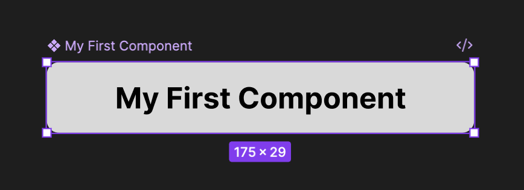

# Components
This is where beginners become designers.

Imagine a Login Button without components. You make 50 buttons. Later... Client says "Make them blue." You cry. Because now you have 50 edits to do.

### With Components, One master button
> Master Button -> Instance -> Instance -> Instance

Change master. Everything updates. Magic.

## How?
1. Create One
2. Draw Rectangle
3. Add Text
4. Select both
5. Right Click
6. Create Component or

### Shortcut
|Type|Shortcut Keys|
|---|---|
|Mac|⌥⌘K or Opt+Cmd+K|
|Windows|Ctrl+Alt+K|

Now you'll see `Purple outline.` That's a component.

