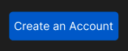

# Components States

Component states are the different visual or functional conditions a UI component can have depending on user interaction or system status.

Here's a button:
<p align="left">

</p>

Looks finished? *It isn't.*

A user can:

- See it
- Hover it
- Focus it
- Press it
- Wait for it
- Be prevented from using it

Therefore you might need:

- **Default** - Normal appearance before interaction
- **Hover** - When the pointer is over the component
- **Focus** - When the component is selected through keyboard navigation or other input
- **Pressed** - While the user is clicking or pressing it
- **Loading** - While an action is being processed
- **Disabled** - When the component cannot currently be interacted with

> Reference: Here's a [<u>link</u>](https://www.youtube.com/watch?v=ReNbXhaL3Xk) that might help.

## Important distinction

- **Component State** answers *"What's happening right now?"*
- **Type/variant** answers *"What kind of component is this?"*

So:

```
Type
├── Primary
├── Secondary
└── Destructive

State
├── Default
├── Hover
├── Focus
├── Pressed
└── Disabled
```

## Accessibility moment

Keyboard user presses `Tab`. How do they know the button is selected?

You need a visible **focus state.** This is why component states aren't merely decoration.