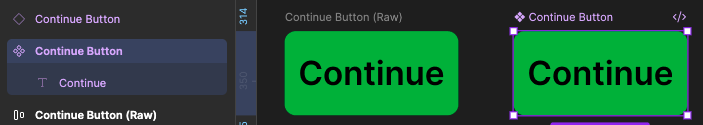
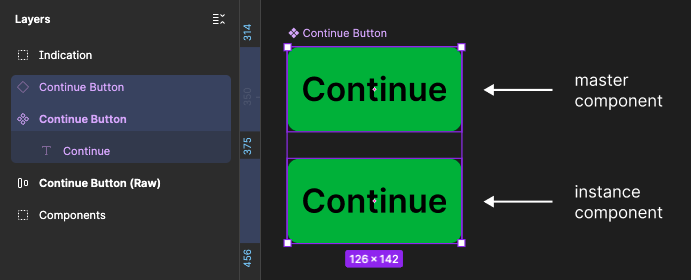

# Variants & Properties

## The Mental Model

- Component - the thing
- Variant - which version of the thing
- Property - the control you expose to change the thing

### Create any easy button

Then do this:

1. Press T
2. Type for example: `Continue`
3. Select the text
4. Press `Shift + A` → Auto Layout
5. Give it a background color
6. Set padding around 16 horizontal / 10 vertical
7. Set corner radius to 8
8. Select the whole thing
9. Create Component

You now have:

```
◆ Button
   └── Continue
```

<p align="center">

</p>

That's a **component**.

Duplicate an instance somewhere.

```
MASTER               INSTANCE

◆ [ Continue ]       ◇ [ Continue ]
```

<p align="center">

</p>

> TRY: Change the master and see what happens

But right now our button only knows how to be one kind of button.

## What is a Variant?

Suppose the Head of Design Team needs two buttons.

```
Primary:
┌────────────────┐
│    Continue    │   ← blue background
└────────────────┘

Secondary:
┌────────────────┐
│     Cancel     │   ← outlined
└────────────────┘
```

These aren't completely different components. They're both **Button**.

They're simply different variants of Button.

### For Example

Think about clothing:
```
Product = T-Shirt

Color:
○ Black
● White
○ Blue

Size:
○ S
● M
○ L
```

You don't consider those six completely unrelated products. They're *variations* of the same underlying thing.

Same idea in Figma.

Now suppose you make these individually:

- Active Buttons
  - Primary Button
  - Secondary Button
- Disabled Buttons
  - Primary Disabled Button
  - Secondary Disabled Button
- Icon Buttons
  - Primary Icon Button
  - Secondary Icon Button

You're creating another mess. Instead, you can do this:

```
Button
│
├── Type
│   ├── Primary
│   ├── Secondary
│   └── Destructive
│
├── Size
│   ├── Small
│   ├── Medium
│   └── Large
│
└── State
    ├── Default
    ├── Hover
    ├── Focus
    └── Disabled
```

Then component properties can control things such as:

```
Label       → text property
Show Icon   → boolean property
Icon        → instance swap
```

Now an instance can essentially say:

```
Button

Type: Primary
Size: Medium
State: Default
Show icon: Yes
Label: Upload File
```

**This is significantly more scalable.**

## Quick Exercise

Go to exercises/day-4/05-exercise.md