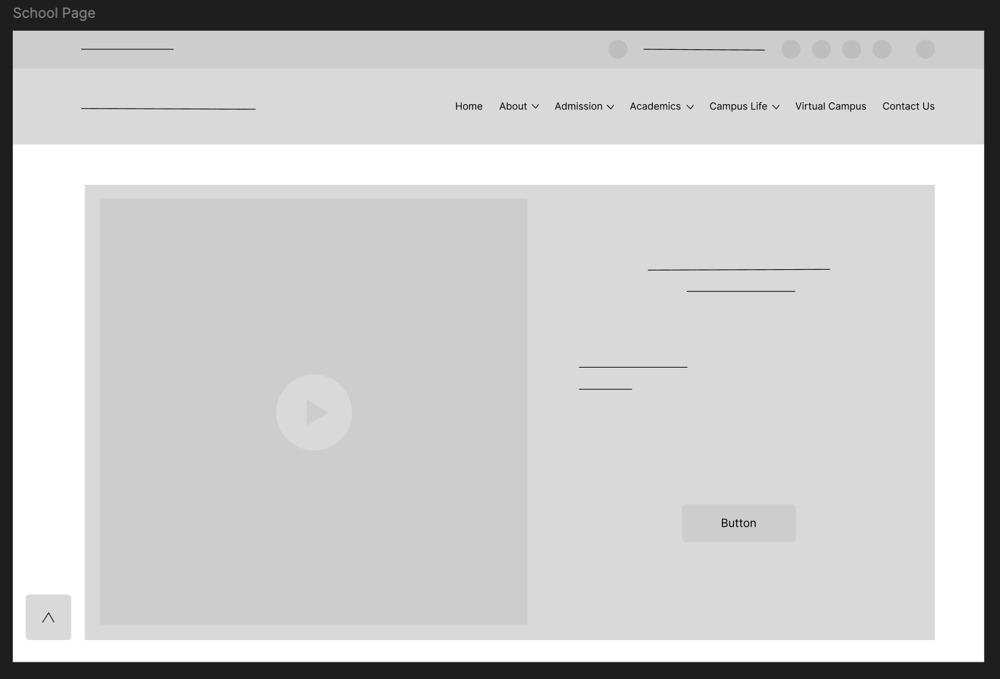

# Exercise 2

Wireframe your university portal.

You may use any of the suggested softwares below:
- [Figma](https://www.figma.com/) (Recommended)
- [Canva](https://www.canva.com/)
- [draw io](https://www.drawio.com/)
- [Wireframe](https://wireframe.cc/) or
- *Even a rough sketch on your paper*

---

### Output Sample

