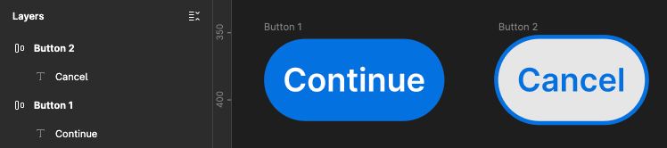
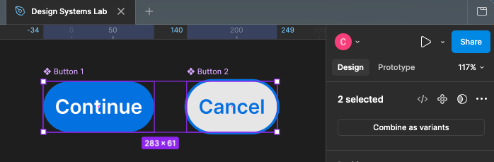
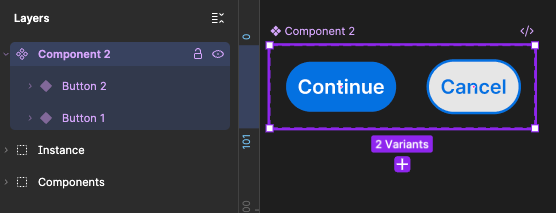
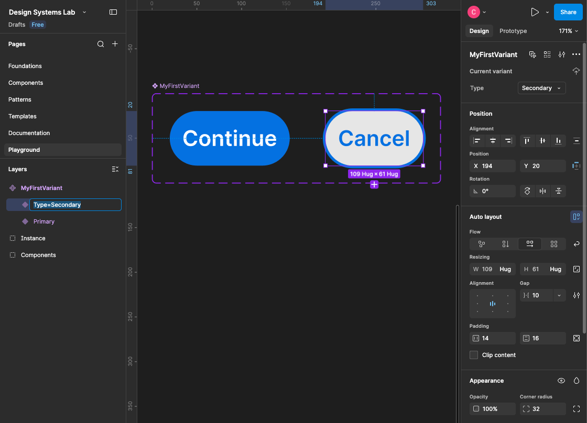
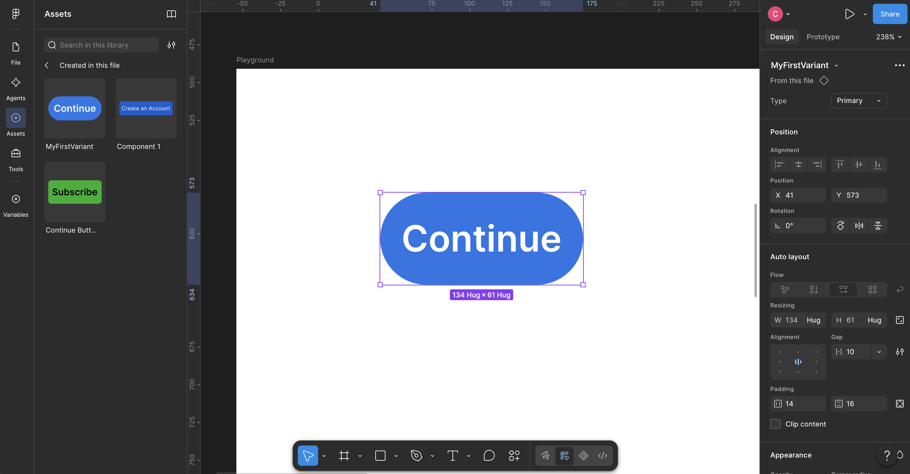

# Exercise 5 Answer Key

Primary vs Secondary

## 1. Creating the buttons
  
    > Don't forget to make them as components.

<p align="left">

</p>

## 2. Combine as Variants

<p align="left">

</p>
<p align="left">

</p>

## 3. Variant Properties

<p align="left">

</p>

## 4. Test if your Variants work

Assuming you already have a component set like:

```
Button
├── Type=Primary
└── Type=Secondary
```

1. **Create a Playground frame**

    - Press F and draw a frame somewhere away from your components. Rename it: `Playground`  
    - This is simply an area where you'll test components without modifying the originals.

2. **Open Assets**
    
    - In the left sidebar, switch from Layers to Assets. 
    - You should find your: `Button` component there.
    - Drag Button from Assets onto your **Playground** frame.
        
        The important distinction is:

        ```
        Original Component Set
            ↓
        ◆◆ Button
        ├── Primary
        └── Secondary


        Playground
            ↓
        ◇ Button     ← Instance
        ```

        You're testing an instance, not editing the original component.

3. Select the instance

    - Click the Button you just dragged into Playground. Look at the right sidebar.
    - Under the component/variant properties, you should see something similar to:

        ```
        Button

        Type
        [ Primary  ▼ ]
        ```

    - Click Primary. You should then be able to choose: `Secondary`
    - The instance should immediately change to your Secondary design.

    <p align="left">
    
    </p>

    <br><br><br>

### Note

And yes, you can do this on the [<u>Figma free plan</u>](https://www.figma.com/pricing/). Just make sure it's in your personal drafts (not team's).