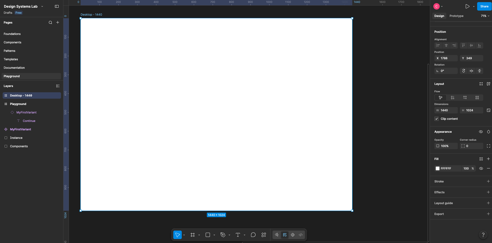
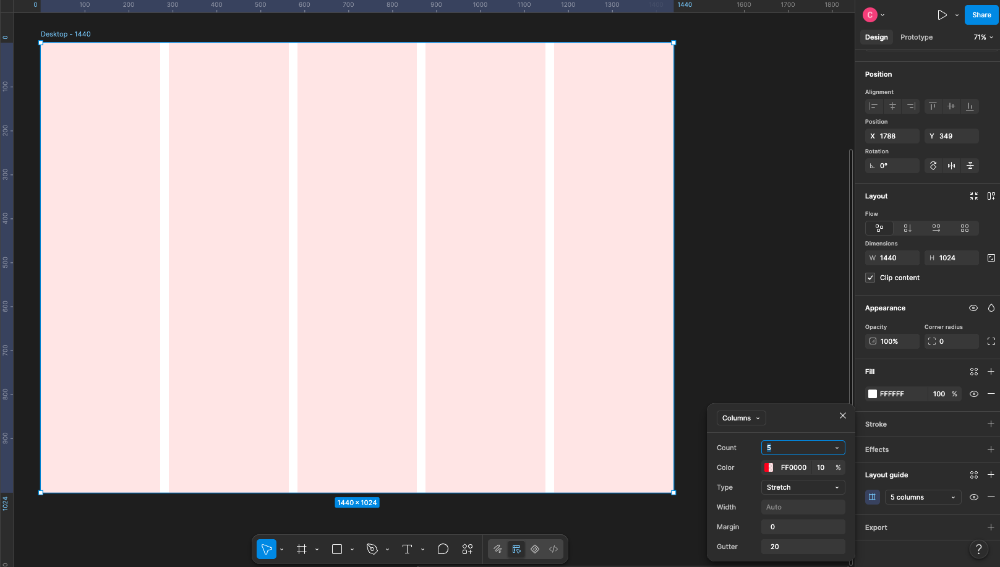
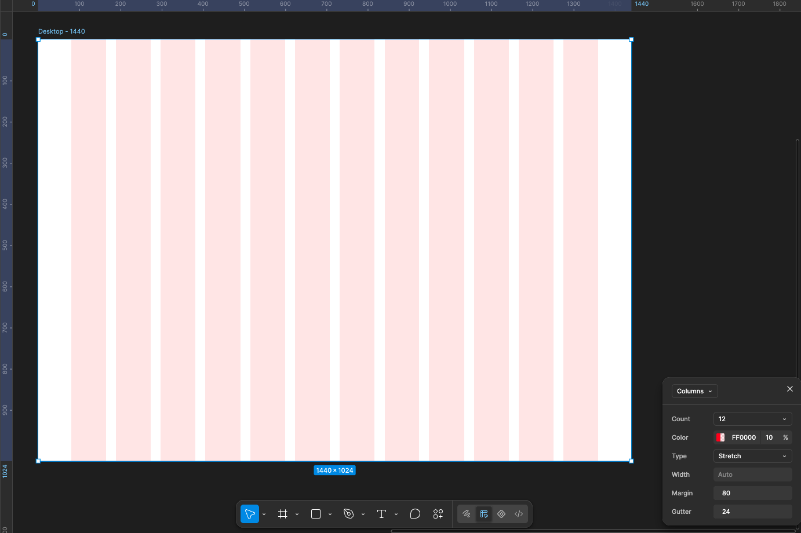
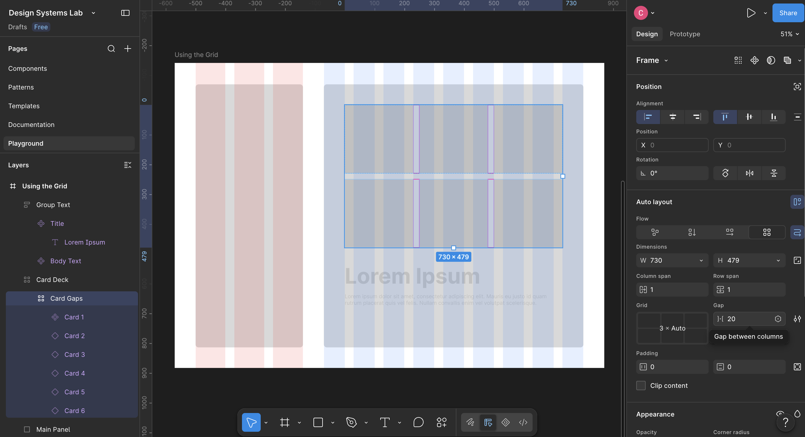
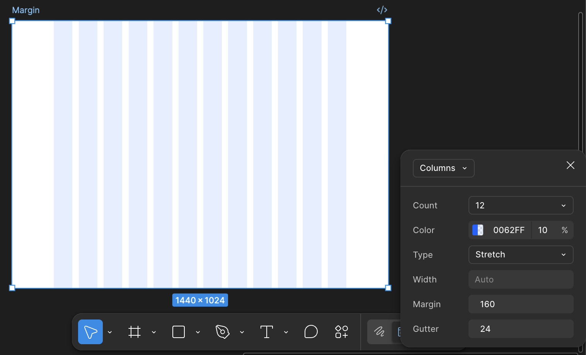
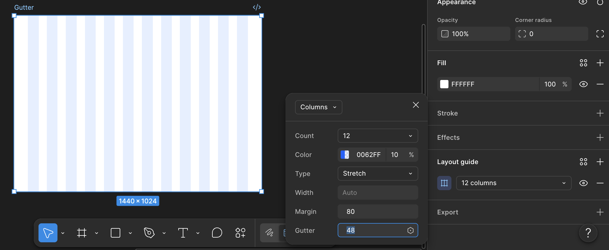
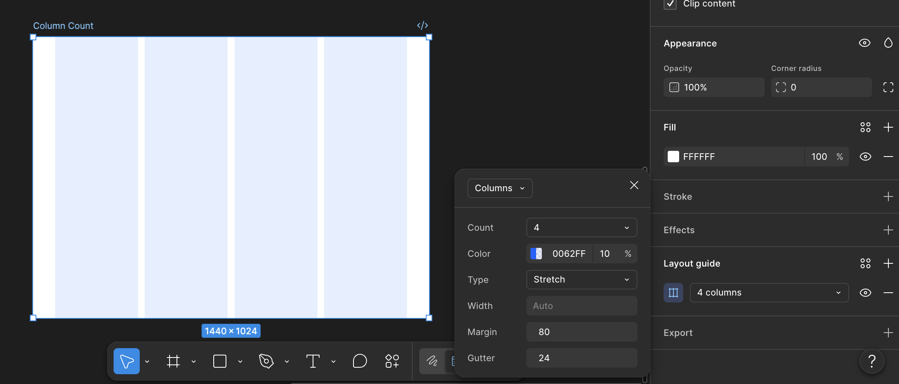

# Build a 12-Column Desktop Grid

### 1. Creating the frame

### 2. Adding a Layout Grid

### 3. Configuring the First 12-column grid

### 4. Using the grid

### 5. Margin Experiment

> Note: Margin appears when the column type is **Stretch**

### 6. Gutter Experiment

### 7. Column Count Experiment

