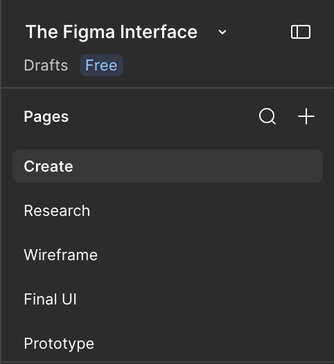
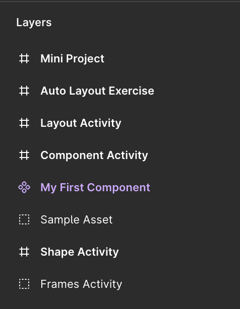
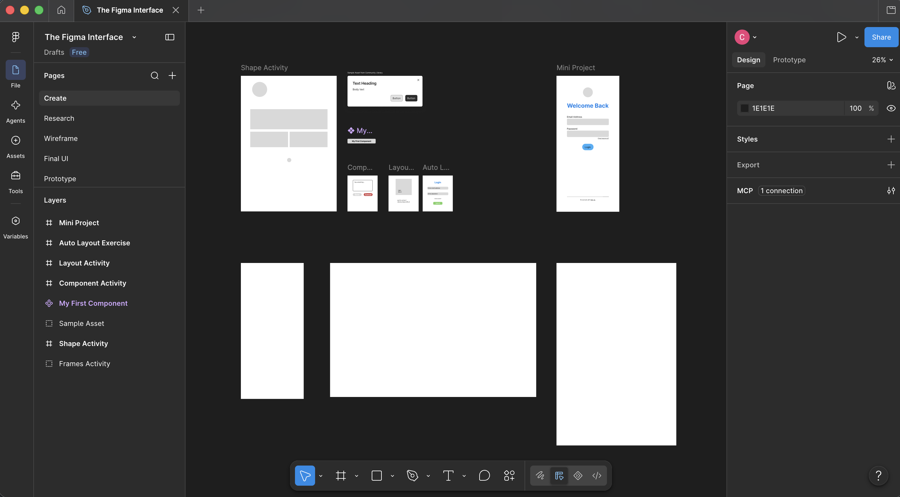
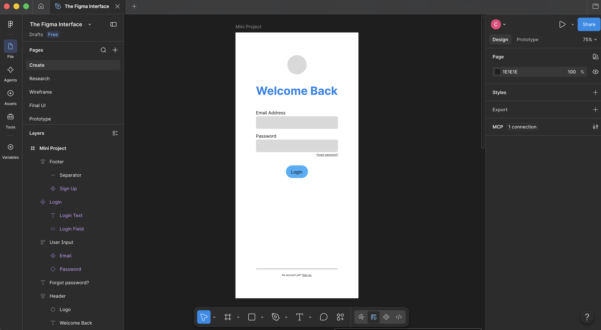

# Login Screen
This is a simple **login screen** layout which has no reference used. But, it is what any internet users usually see when logging/signing up in a website.

There's no '*strict*' intructtions to follow, better to let yourself feel how things should be in your own perspective and comfortably allow yourself to make '*mistakes*'.

Here's the link to view:
[The Figma Interface](https://www.figma.com/design/TK0zy3ou77LrBMthlc7noZ/The-Figma-Interface?node-id=7-33&t=biYOFKqb3QQyf1lE-1)

## Screenshots

 
 
 
 

